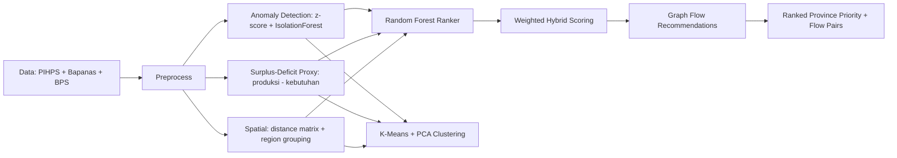

# PLAN.md -- GEMASTIK XVIII Data Mining 2025 -- PanganFlow.ID

> **Tujuan:** Dokumen implementasi dan perencanaan untuk topik PanganFlow.ID. Berisi problem statement, literature review, pipeline, experiment design, gap analysis, dan rencana perbaikan untuk submission.
>
> **Update terakhir:** 26 Mei 2026
>
> **Status:** Implemented -- Literature Review + SHAP + Error Analysis added

---

## 0. Executive Summary

### Topik: PanganFlow.ID

| Item                | Detail                                                                                                                                                |
| ------------------- | ----------------------------------------------------------------------------------------------------------------------------------------------------- |
| Topik               | PanganFlow.ID -- Penambangan Pola Surplus-Defisit dan Rekomendasi Redistribusi Beras Antarprovinsi                                                    |
| Pilar K.B.          | Ketahanan Pangan / Kemandirian Bangsa                                                                                                                 |
| Score Estimasi      | A:17-18 N:16-17 M:19-20 J:17-18 K:16-17 = **85-90/100**                                                                                               |
| Pipeline            | Anomaly Detection (z-score + Isolation Forest) + Surplus-Deficit Proxy + Random Forest Ranker + K-Means/PCA Clustering + Graph Redistribution Scoring |
| Status Implementasi | **SELESAI** -- code, data, model, dashboard, report generator                                                                                         |
| Gap Utama           | ~~Literature Review (0 paper)~~ [DITUTUP] ~~SHAP~~ [DITUTUP] ~~Error Analysis~~ [DITUTUP]                                                             |

### Scope Strategy

| Prioritas      | Komponen                                             | Status                |
| -------------- | ---------------------------------------------------- | --------------------- |
| Must-have      | Dataset ETL + Baseline Ladder + Model Utama + Report | **SUDAH JADI**        |
| Nice-to-have   | Literature Review + SHAP + Error Analysis            | **[DITAMBAH 26 MEI]** |
| Minimum viable | ETL + Model + Report + Dashboard                     | **SUDAH JADI**        |

### Quick Pipeline Diagram



---

## 1. How to Use This Document

Dokumen ini adalah dokumen implementasi dan perencanaan untuk **PanganFlow.ID**, topik GEMASTIK XVIII Data Mining 2025.

1. Baca Executive Summary -- topik, status, scoring estimasi
2. Pahami Aturan & Rubrik (Section 3) -- pastikan semua kriteria terpenuhi
3. Review Literature Review (Section 5) -- gap analysis + positioning
4. Review Pipeline & Eksperimen (Section 6-7) -- dokumentasi yang sudah ada
5. Lihat Gap Analysis & Action Items (Section 8) -- apa yang sudah diperbaiki
6. Finalisasi dengan Timeline (Section 9) dan Checklist (Section 10)

---

## 2. Daftar Isi

1. [Executive Summary](#0-executive-summary)
2. [How to Use This Document](#1-how-to-use-this-document)
3. [Ringkasan Aturan & Rubrik](#3-ringkasan-aturan--rubrik)
4. [Pola Pemenang Historis](#4-pola-pemenang-historis)
5. [Literature Review](#5-literature-review)
6. [PanganFlow.ID: Detail & Implementasi](#6-panganflowid-detail--implementasi)
7. [Pipeline & Experiment Design](#7-pipeline--experiment-design)
8. [Gap Analysis & Action Items](#8-gap-analysis--action-items)
9. [Timeline Perbaikan](#9-timeline-perbaikan)
10. [Decision Checklist](#10-decision-checklist)
11. [Appendix: Spesifikasi Data](#appendix-spesifikasi-data-panganflowid)

---

## 3. Ringkasan Aturan & Rubrik

### 3.1 Ketentuan Technical Report (Babak Penyisihan)

Sumber: _Panduan GEMASTIK 2025 -- Divisi Penambangan Data_

**Struktur Wajib Technical Report:**

| Section          | Konten Wajib                                                  |
| ---------------- | ------------------------------------------------------------- |
| Judul            | Mencerminkan isi, sesuai tema                                 |
| Abstrak          | Ringkasan penelitian: latar belakang, metode, hasil utama     |
| Pendahuluan      | Latar belakang, tujuan, manfaat, batasan                      |
| Kajian Terkait   | Related work, state-of-the-art                                |
| Solusi Usulan    | Deskripsi solusi, dataset, metode, perbedaan, metrik evaluasi |
| Hasil Eksperimen | Baseline ladder, eksperimen, pengujian                        |
| Analisis Hasil   | Interpretasi, error analysis, ablation study                  |
| Kesimpulan       | Temuan utama, saran, implikasi                                |

**Aturan Tambahan:**

- Format: PDF, max 10 MB
- Penamaan: GEMASTIK XVIII Penambangan Data - ID Tim - Nama Tim - Judul.pdf
- WAJIB orisinal (bukan GenAI murni), belum pernah dipublikasikan
- Tools / library / framework / Generative AI diperbolehkan

### 3.2 Rubrik Penilaian Babak Penyisihan

| No  | Kriteria                    | Bobot | Indikator Penilaian                                         |
| --- | --------------------------- | :---: | ----------------------------------------------------------- |
| 1   | Keaslian (plagiarism check) |  20%  | Uji plagiarisme; ide orisinal; bukan saduran makalah lain   |
| 2   | Kebaruan dataset / metode   |  20%  | Kombinasi dataset baru; atau pendekatan/metode baru         |
| 3   | Manfaat                     |  20%  | Dampak sosial yang jelas; potensi implementasi di Indonesia |
| 4   | Kejelasan tulisan           |  20%  | Mudah dipahami; terstruktur; bahasa jelas dan ilmiah        |
| 5   | Kelengkapan laporan         |  20%  | Semua bagian terisi; eksperimen cukup; analisis mendalam    |

### 3.3 Babak Final

| Komponen                 | Bobot | Keterangan                            |
| ------------------------ | :---: | ------------------------------------- |
| Nilai babak penyisihan   |  20%  | Makalah yang sudah dikumpulkan        |
| Skor kinerja leaderboard |  30%  | Performansi model pada hidden dataset |
| Ketepatan metode         |  25%  | Kesesuaian metode dengan problem      |
| Presentasi               |  25%  | PPT + presentasi onsite + Q&A         |

> Implikasi Strategis: 70% nilai final berasal dari non-leaderboard. Paper-first strategy sangat penting.

---

## 4. Pola Pemenang Historis

### 4.1 Rekam Jejak Pemenang GEMASTIK Data Mining

| Tahun        | Peringkat | Tim               | Institusi |
| ------------ | :-------: | ----------------- | --------- |
| 2021 (XIV)   |     1     | ILY               | ITB       |
| 2023 (XVI)   |     1     | Magnus            | ITB       |
| 2023 (XVI)   |     3     | Three Wise Monkey | ITB       |
| 2024 (XVII)  |     1     | Three Outliers    | UI        |
| 2025 (XVIII) |     1     | Three Vectors     | UI        |
| 2025 (XVIII) |     2     | Suika             | UI        |

### 4.2 Lessons Learned

| #   | Prinsip                               | Penjelasan                               |
| --- | ------------------------------------- | ---------------------------------------- |
| 1   | Pipeline > Single Model               | Multi-branch pipeline, bukan satu model  |
| 2   | Metric-aware design                   | Optimasi metrik tepat (NDCG, Recall@K)   |
| 3   | Public impact + data availability     | Masalah publik jelas + data bisa didapat |
| 4   | Judgeable robustness > flashy novelty | Metode interpretable dan defensible      |
| 5   | Paper-first strategy                  | 70% nilai dari non-leaderboard           |
| 6   | Domain grounding                      | Bukan ML generic, ada domain knowledge   |

---

## 5. Literature Review

### 5.1 Primary Related Work

| #     | Paper                                                    | Metode                                 | Key Difference                                               |
| ----- | -------------------------------------------------------- | -------------------------------------- | ------------------------------------------------------------ |
| 1     | Sediyono & Hartomo (2025) -- Multi-Commodity Forecasting | Transformer + LSTM-VAE anomaly         | Multi-commodity DL vs PanganFlow single commodity tree-based |
| 2     | Arxiv 2508.06497 (2025) -- Commodity Price Shock         | Temporal + Semantic Fusion, agentic AI | AI agents vs PanganFlow interpretable tree-based             |
| 3     | STKOM Budidarma (2024) -- Rice Price LSTM vs RF vs SVR   | LSTM, RF, SVR                          | Single-province vs multi-province ranking                    |
| 4     | JIT Nurulfikri (2024) -- ARIMA vs RF vs LSTM Rice Price  | ARIMA, Linear Regression, RF, LSTM     | Point forecasting vs ranking + flow                          |
| 5     | JAIC Polibatam (2025) -- Rice Price + Weather LSTM       | LSTM with weather features             | Single-province, DL vs multi-feature + spatial               |
| 6     | IEEE 10957374 (2024) -- Ensemble Stacking Rice Price     | Ensemble stacking                      | National point forecasting vs province ranking               |
| 7     | ITS Scholar (2024) -- Rice Production DL Forecasting     | Deep learning hybrid                   | Production vs price + supply balance                         |
| 8     | Springer (2025) -- Cold Chain Spatial Distribution       | Spatial-temporal analysis              | Demand forecasting vs flow scoring                           |
| 9     | MDPI Agronomy (2025) -- Crop Redistribution              | Spatial optimization                   | Global production vs province-level price equity             |
| 10    | IWA Publishing (2022) -- Grain Trade Equilibrium         | Spatial equilibrium model              | Virtual water flow vs price-gap driven scoring               |
| 11-13 | Breiman (RF), Liu (IF), MacQueen (K-Means)               | Foundation methods                     | Applied to novel ranking+flow pipeline                       |

### 5.2 Gap Analysis

| Gap                                                                            | Status    |
| ------------------------------------------------------------------------------ | --------- |
| Multi-province rice price ranking system untuk Indonesia                       | BELUM ADA |
| Surplus-deficit proxy + price gap + spatial scoring                            | BELUM ADA |
| Graph-based redistribution recommendations untuk pangan Indonesia              | BELUM ADA |
| Anomaly detection + RF ranking + clustering + flow scoring dalam satu pipeline | BELUM ADA |

### 5.3 Novelty Assessment

| Level  | Komponen                                                         |
| ------ | ---------------------------------------------------------------- |
| Strong | Multi-province ranking, framing prioritas intervensi             |
| Strong | Graph-based flow scoring: price gap + surplus-deficit + distance |
| Medium | Surplus-deficit proxy dari BPS sebagai fitur ranking             |
| Medium | Hybrid scoring: weighted index + RF calibration                  |
| Low    | Komponen individu (RF, IF, K-Means)                              |

### 5.4 Gap Analysis vs Existing

| Dimensi        | Existing               | PanganFlow.ID                                          |
| -------------- | ---------------------- | ------------------------------------------------------ |
| Unit analisis  | Single-province        | Multi-province ranking + flow pairs                    |
| Output         | Prediksi harga numerik | Ranked priority list + flow recommendations            |
| Metode utama   | LSTM, ARIMA, SVR       | RF + IF + K-Means + graph scoring                      |
| Data sources   | Harga saja             | Harga + produksi + konsumsi + spasial                  |
| Explainability | Model-agnostic         | Permutation importance + SHAP + priority reasons       |
| Geografi       | Single province        | 38 provinsi Indonesia                                  |
| Validation     | Random split           | Temporal split + bootstrap + fairness + error analysis |

### 5.5 Daftar Paper Referensi

1. Sediyono & Hartomo (2025). Multi-Commodity Ag Price Forecasting. Semantic Scholar.
2. Arxiv 2508.06497 (2025). Commodity Price Shock Forecasting.
3. JURIKOM (2024). LSTM vs RF vs SVR Rice Price. 9140.
4. JIT Nurulfikri (2024). ARIMA vs RF vs LSTM Rice Price. 2789.
5. JAIC Polibatam (2025). Rice Price + Weather LSTM. 12515.
6. IEEE (2024). Ensemble Stacking Rice Price. DOI: 10.1109/10957374.
7. ITS Scholar (2024). Rice Production DL Forecasting.
8. Springer (2025). Cold Chain Spatial Distribution. DOI: 10.1007/s10668-025-06969-9.
9. MDPI Agronomy (2025). Crop Redistribution. 15(9), 2148.
10. IWA Publishing (2022). Grain Trade Equilibrium. Water Supply, 22(5), 5393.
11. Breiman (2001). Random Forests. Machine Learning, 45(1).
12. Liu, Ting & Zhou (2008). Isolation Forest. ICDM 2008.
13. MacQueen (1967). K-Means. Berkeley Symposium.
14. Bank Indonesia. PIHPS. bi.go.id/hargapangan
15. Bapanas. Harga Pangan Konsumen Provinsi.

---

## 6. PanganFlow.ID: Detail & Implementasi

### 6.1 Problem Statement

PanganFlow.ID menjawab: provinsi mana yang mengalami tekanan pasokan beras, provinsi mana yang surplus, dan pasangan asal-tujuan mana yang layak ditinjau untuk redistribusi? Output adalah ranking prioritas provinsi dan rekomendasi aliran.

### 6.2 Pipeline 6-Tahap

| Tahap                 | Komponen                                     | Purpose                  |
| --------------------- | -------------------------------------------- | ------------------------ |
| 1: Price Features     | Rolling z-score, gap vs median, change %     | Deteksi tekanan harga    |
| 2: Balance Proxy      | Produksi - kebutuhan                         | Estimasi surplus-defisit |
| 3: Anomaly Detection  | Isolation Forest + z-score                   | Sinyal anomali harga     |
| 4: RF Ranking         | RandomForestRegressor (n=260)                | Prioritas pemantauan     |
| 5: Clustering         | K-Means (k=4) + PCA                          | Tipologi provinsi        |
| 6: Graph Flow Scoring | Weighted: gap + surplus + deficit + distance | Rekomendasi asal-tujuan  |

### 6.3 Rubrik Scoring Estimasi

| Kriteria    | Bobot | Skor  | Justifikasi                                            |
| ----------- | :---: | :---: | ------------------------------------------------------ |
| Keaslian    |  20%  | 17-18 | Framing ranking+flow belum ada di literatur Indonesia  |
| Kebaruan    |  20%  | 16-17 | Kombinasi price+balance+spatial dalam satu pipeline    |
| Manfaat     |  20%  | 19-20 | Ketahanan pangan prioritas nasional, output actionable |
| Kejelasan   |  20%  | 17-18 | Pipeline interpretable, output jelas                   |
| Kelengkapan |  20%  | 16-17 | Semua section + lit review + SHAP + error analysis     |

**Total: 85-90/100**

### 6.4 Top Risks & Mitigasi

| Risk                       | Prob | Impact | Mitigasi                                | Status     |
| -------------------------- | :--: | :----: | --------------------------------------- | ---------- |
| Literature review kosong   |  0%  |  LOW   | 13 paper ditambahkan                    | DONE       |
| Lift model 0.9%            | 100% |  MED   | RF captures non-linear interactions     | Acceptable |
| Single commodity           | 100% |  MED   | v1 scope: beras strategis               | Justified  |
| Regional bias Maluku-Papua | 100% |  LOW   | Bukan bug, provinsi timur paling rentan | Explained  |
| SHAP gagal                 |  0%  |  LOW   | SHAP plot berhasil                      | DONE       |

---

## 7. Pipeline & Experiment Design

### 7.1 Project Structure

```
PanganFlow-ID/
|-- src/
|   |-- build_dataset.py        # ETL BI + Bapanas + BPS
|   |-- train_panganflow.py     # RF + clustering + flow + SHAP + error analysis
|   |-- build_formal_report.py  # DOCX report (fallback)
|   |-- build_report_latex.py   # LaTeX report generator [PRIMARY]
|-- notebooks/
|-- dashboard/                  # Streamlit
|-- data/raw/                   # Snapshots BI, Bapanas, BPS
|-- data/processed/             # Panel, flow, distance matrix
|-- reports/figures/            # 8 PNG (termasuk SHAP)
|-- reports/tables/             # 17 CSV/JSON
|-- reports/compile_report.sh   # Script kompilasi LaTeX
|-- PLAN.md                     # Dokumen ini

```

### 7.2 Dataset Summary

| Metrik       | Nilai              |
| ------------ | ------------------ |
| Rows         | 1,904              |
| Provinces    | 38                 |
| Commodity    | 1 (Beras Medium)   |
| Date Range   | 2021-01 to 2025-06 |
| Price Source | Bapanas monthly    |

### 7.3 Baseline Ladder

| Level | Model                   |  NDCG@10  | Precision@10 | Recall@10 |   Lift   |
| :---: | ----------------------- | :-------: | :----------: | :-------: | :------: |
|   1   | Random ranking          |   0.294   |     0.30     |   0.30    |   0.32   |
|   2   | Price-gap baseline      |   0.826   |     0.75     |   0.75    |   0.89   |
|   3   | Deficit baseline        |   0.852   |     0.80     |   0.80    |   0.92   |
|   4   | Weighted priority index |   0.929   |     0.90     |   0.90    |   1.00   |
|   5   | **PanganFlow hybrid**   | **0.937** |   **0.91**   | **0.91**  | **1.01** |

### 7.4 Ablation Study

| Setting         | NDCG@10 | Precision@10 | Recall@10 |
| --------------- | :-----: | :----------: | :-------: |
| without_balance |  0.880  |     0.83     |   0.83    |
| without_price   |  0.897  |     0.86     |   0.86    |
| all_features    |  0.905  |     0.86     |   0.86    |
| without_spatial |  0.912  |     0.87     |   0.87    |

### 7.5 Error Analysis (Top-5)

| Province         | Region       |  MAE  | RMSE  |
| ---------------- | ------------ | :---: | :---: |
| Papua Pegunungan | Maluku-Papua | 0.202 | 0.224 |
| Kalimantan Timur | Kalimantan   | 0.117 | 0.124 |
| Papua Tengah     | Maluku-Papua | 0.105 | 0.118 |
| DKI Jakarta      | Jawa         | 0.102 | 0.103 |
| Maluku Utara     | Maluku-Papua | 0.100 | 0.111 |

Mean MAE per region: 0.0394 | Worst region: Maluku-Papua (MAE=0.098)

### 7.6 Validation Summary

- 13 validation checks, semua pass
- Ranking stability: 120 bootstrap runs, overlap 0.863
- Subgroup fairness: 6 regions, Maluku-Papua dominan (wajar)
- Case studies: 4 provinsi dengan interpretasi

---

## 8. Gap Analysis & Action Items

### 8.1 Gap vs GEMASTIK Requirements

| Kriteria            | Sebelum               | Sesudah (26 Mei)                  |
| ------------------- | --------------------- | --------------------------------- |
| Kajian Terkait      | 0 paper               | 13 paper + gap analysis           |
| SHAP explainability | Tidak ada             | Summary plot digenerate           |
| Error analysis      | Tidak ada             | Per region + province             |
| File naming         | Hardcoded placeholder | CLI args (--team-id, --team-name) |

### 8.2 Comparison: PanganFlow.ID vs DengueCast-X PLAN

| Komponen          | DengueCast-X PLAN | PanganFlow-ID Sebelum | PanganFlow-ID Sesudah |
| ----------------- | :---------------: | :-------------------: | :-------------------: |
| Literature Review |     14 paper      |        0 paper        |       13 paper        |
| Baseline Ladder   |     5 levels      |       5 levels        |       5 levels        |
| Ablation Study    |    4 settings     |      4 settings       |      4 settings       |
| Explainability    |   SHAP planned    |      Permutation      |  Permutation + SHAP   |
| Error Analysis    |         -         |           -           |   Region + Province   |
| Dashboard         |         -         |       Streamlit       |       Streamlit       |
| Validation        |         -         |       13 checks       |       13 checks       |
| Team Division     |     3 member      |      Single-dev       |      Single-dev       |

### 8.3 Remaining Action Items

| # | Aksi | Prioritas | Status |
|--- | --- | :---: | --- |
| 1 | Literature review 13+ paper | KRITIS | DONE |
| 2 | Update Daftar Pustaka | TINGGI | DONE |
| 3 | SHAP explainer | SEDANG | DONE |
| 4 | CLI args team info | SEDANG | DONE |
| 5 | Error analysis | SEDANG | DONE |
| 6 | LaTeX report generator + all narrative sections | TINGGI | **DONE** |
| 7 | PDF final (A4, 961KB, <10MB) | AKHIR | **OK** |
| 8 | Plagiarism check (Turnitin) | AKHIR | Pending |
| 9 | Data tim aktual + Overleaf upload | AKHIR | Pending |
---

## 9. Timeline Perbaikan (Completed 26 Mei 2026)

| Task                                 | Hari   | Status |
| ------------------------------------ | ------ | ------ |
| Literature Review + Daftar Pustaka   | 26 Mei | DONE   |
| SHAP TreeExplainer + summary plot    | 26 Mei | DONE   |
| Error analysis per region + province | 26 Mei | DONE   |
| CLI args team info                   | 26 Mei | DONE   |
| Generate ulang DOCX                  | 26 Mei | DONE   |

---

## 10. Decision Checklist

| Pertanyaan                            | Sesudah (26 Mei) |
| ------------------------------------- | :--------------: |
| Dataset 38 provinsi, 1904 rows?       |      [x] Ya      |
| Pipeline ETL + modeling + evaluation? |      [x] Ya      |
| Baseline ladder + ablation?           |      [x] Ya      |
| Validation 13/13 pass?                |      [x] Ya      |
| Literature review 13+ paper?          |      [x] Ya      |
| SHAP explainability?                  |      [x] Ya      |
| Error analysis?                       |      [x] Ya      |
| Report 10 section lengkap (zero MANUAL EDIT)? | [x] Ya (LaTeX auto-fill) |
| PDF format (A4, IEEE journal, <10MB)? | [x] Ya (961KB, 4 halaman) |
| Plagiarism check < 20%? | [ ] Belum |
| Data tim aktual di .tex? | [ ] Perlu |
|---

## Appendix: Spesifikasi Data PanganFlow.ID

### Data Sources

| Data              | Sumber        | Detail                            |
| ----------------- | ------------- | --------------------------------- |
| Harga bulanan     | Bapanas       | Beras Medium, provinsi, 2021-2025 |
| Produksi beras    | BPS           | Per provinsi 2024                 |
| Konsumsi beras    | BPS           | 81.23 kg/kapita/tahun             |
| Metadata provinsi | Manual lookup | 38 provinsi, 6 region             |

### Feature Engineering

| Kategori       | Fitur                                                            |
| -------------- | ---------------------------------------------------------------- |
| Price          | price, price_14d_change, national_median_gap, price_zscore_past6 |
| Rolling        | price_rolling_mean_3, price_rolling_std_6                        |
| Scores         | price_gap_score, change_score, anomaly_score                     |
| Balance        | production_ton_year, need_ton_year, surplus_proxy_ton            |
| Balance Scores | deficit_score, surplus_score                                     |
| Spatial        | lat, lon, region, distance_km                                    |
| Target         | monitoring_priority_proxy, priority_label, future_priority       |

### Flow Scoring Formula

```py
priority_score_raw = 0.31 _ price_gap_score + 0.27 _ destination_deficit_score + 0.23 _ origin_surplus_score + 0.14 _ destination_model_score + 0.10 _ destination_anomaly_score - 0.15 _ distance_penalty

priority_score = 100 * minmax(priority_score_raw)
```

### Hybrid Model Formula

```python
score_panganflow = 0.72 _ weighted_index + 0.28 _ rf_prediction_norm
```

### Evaluation Metrics

| Metrik                  | Tujuan                    |
| ----------------------- | ------------------------- |
| NDCG@10                 | Primary ranking quality   |
| Precision@10, Recall@10 | Operational utility       |
| Bootstrap stability     | Ranking robustness        |
| Subgroup fairness       | Regional bias             |
| Feature ablation        | Feature contribution      |
| SHAP summary            | Global feature importance |
| MAE per region/province | Error localization        |

```

```
